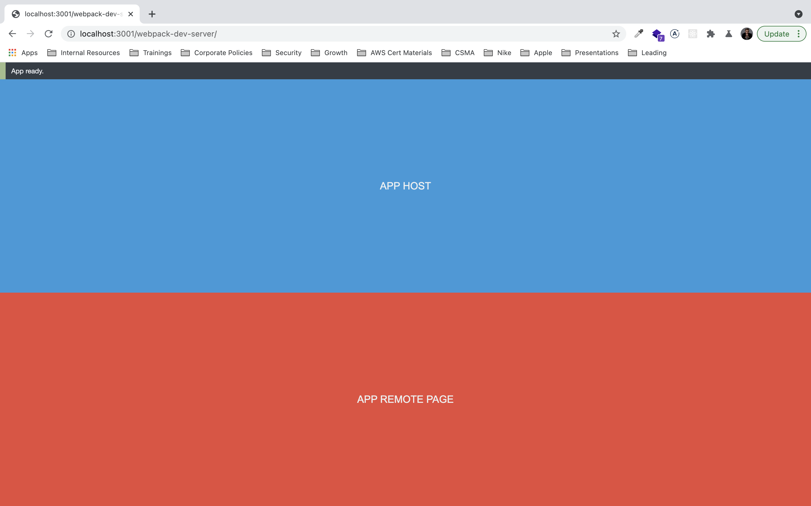
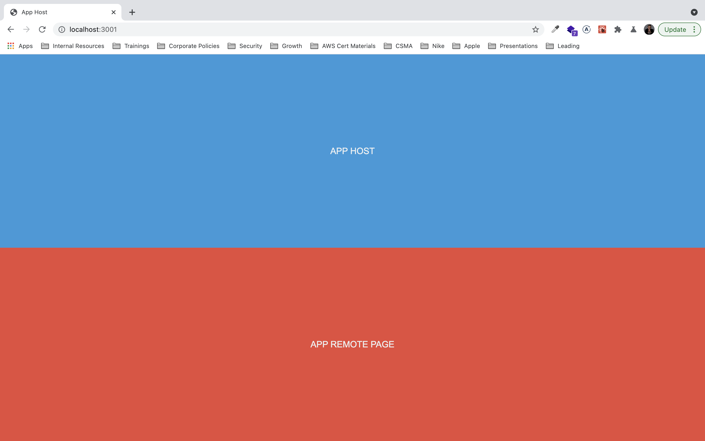

### The main reason why this repo was created

It was created for investigation purposes why NODE_ENV=production can broke webpack 5 module federation plugin

Behavior in another project:

1. NODE_ENV !== 'production' – everything works fine
2. NODE_ENV === 'production' – container with exposed components is undefined, so we can't use micro-frontend

To check, that issue not relates to webpack 5 you can do steps below:

Install dependencies

```
yarn install && yarn lerna bootstrap
```

1. Run in dev mode

```
yarn lerna run serve --parallel
```

2. Open in browser http://localhost:3001/webpack-dev-server/

3. You should see `App Host` and `App Remote Page` components



4. Run in prod mode

```
yarn lerna run build --parallel
```

5. Host in different terminals static files

```
# terminal 1
yarn http-server frontend/apps/app-host/dist -p 3001
# terminal 2
yarn http-server frontend/apps/app-remote/dist -p 3002
```

6. Open in browser http://localhost:3001/

7. You should see `App Host` and `App Remote Page` components



P.S. In another project we have error like this

```
react-dom.production.min.js:216 Error: Container missing
while loading "./page" from 6448
    at n (remotes loading:39)
    at remotes loading:60
    at u (remotes loading:54)
    at remotes loading:68
    at Array.forEach (<anonymous>)
    at Object.f.f.remotes (remotes loading:31)
    at ensure chunk:6
    at Array.reduce (<anonymous>)
    at Function.f.e (ensure chunk:5)
    at index.tsx:8
```
